<div align='center' ><font size='6'><b>Flow-Shop问题的自适应模拟退火算法</b></font></div>

<div align='center' ><font size='3'>闫国琛  徐特立学院30141902班  学号: 1120191383</font></div>

**摘    要:**  为求得Flow Shop这一NP-Hard问题的最优解或近似优解，本文提出一种自适应的模拟退火算法，采用了基于输入的降温过程设计和简便的调度方案表示，使得算法对于不同规模和性质的输入数据达到效率和性能上的均衡. 

**关键词:**  模拟退火、车间调度、启发式、自适应算法

## 1.引言(Introduction)

​		在现代的工业企业中，生产环节多，协作关系复杂，生产连续性强，某一个生产节点的变化（如某一机器发生故障，某两道工序顺序进行了调整等等），往往会波及整个生产系统的运行. 流水车间（Flow Shop）调度问题是很多实际流水线生产调度问题的简化模型，其研究具有重要的理论意义和工程价值，也是目前研究广泛的一类典型调度问题. 

​		$n$ 个工件和 $m$ 台机器的车间调度问题描述如下： $n$ 个工件必须按同一顺序在 $m$ 台不同的机器上加工，工件 $i$ 在机器 $j$ 上的加工时间为 $p_{i, j}$ . 设：1) 每个工件在每台机器上只能加工一次； 2) 每台机器一次只能加工一个工件； 3) 工件的加工不能中断； 4) 每个工件同时只能被一台机器加工. 调度的目标是找到一种作业顺序，使最后一个作业在最后一台机器上完成的时间最小. 

### 问题的数学描述

​		设 $st_{i,j}$ 为第 $i$ 个工件在第 $j$ 台机器上加工的开始时间，$ed_{i,j}$ 是第 $i$ 个工件在第 $j$ 台机器上的结束时间，$p_{i,j}$ 表示工件 $i$ 在机器 $j$ 上的加工时间. 我们有：

​		1.加工顺序约束：
$$
ed_{i,j} \leq st_{i,j+1} \quad i = 1,2,\cdots ,n. \space j = 1, 2, \cdots , m.
$$
​		表示每个工件必须遵循加工顺序

​		2.机器占用约束：
$$
ed_{i,j}\leq st_{k, j} \space or \space ed_{k, j} \leq st_{i,j} \quad i\neq k
$$
​		表示每台机器同一时刻只能加工一个工件

​		3.全部工件在 $t = 0$ 时刻释放：
$$
st_{i, 1} \geq 0 \quad i = 1, 2, \cdots, n.
$$
​		4.加工过程约束：
$$
st_{i, j} + p_{i, j} = ed_{i, j}
$$
​		5.目标函数：
$$
F = \max_{i = 1}^n {ed_{i, m}}
$$
​		更一般地，Flow Shop调度问题还有加工间隔（time lags）约束：
$$
ed_{i, j} + \theta^{min}_{i,j} \leq st_{i, j+1} \leq ed_{i, j} + \theta^{max}_{i, j}
$$
​		其中，$\theta^{min}_{i, j}$ 和 $\theta^{max}_{i, j}$ 是工件 $i$ 在机器 $j$ 上加工后的最短间隔和最长间隔. 本文研究的问题中，$\theta_{i, j}^{min} = 0, \theta_{i, j}^{max} = \infty$，因此，这一约束可以被忽略. 


​		Flow shop调度问题可分为两类：1）排序Flow Shop调度问题（Permutation Flow Shop Problem，i.e. PFSP），2） 非排序Flow Shop调度问题（Non-Permutation Flow Shop Problem，i.e. NPFSP). PFSP问题要求每台机器的工件加工顺序都一致；若不一致，则称为NPFSP问题. 

​		Flow Shop调度问题具有很强的约束条件. 对于有约束条件的优化问题，模拟退火的普遍策略是将约束条件转化为目标函数中的惩罚项. 在本文讨论的问题中，约束条件与当前状态（当前解）没有直接的对应关系，也难以转化为具有良好梯度特征的惩罚项. 因此，本文采用了简单而有效的状态设计（解空间设计），使得当前状态（当前解）自然地符合约束条件，降低了设计目标函数的难度. 

​		传统的模拟退火降温设计策略往往采用含超参数的几何递减、对数递减的方法，但在本问题中，固定的初始温度和降温过程常常难以适应不同的问题输入. 例如，对于小规模数据，较大的初始温度和缓慢的降温将使得算法在退火前期即达到最优解，而在算法后期进行无用的搜索与计算，浪费了大量的时和资源；而对于较大规模的数据，较小的初始温度和迅速的降温过程又会导致算法未收敛至最优解或近似最优解便停止，算法性能较差. 再如，初始温度的设计和降温过程中温度的取值水平应与输入中工件加工耗时相比拟，否则，过高的温度水平会导致算法几乎接受所有更差解，算法难以收敛；过低的温度水平又会导致算法几乎不接受更差解，模拟退火算法退化为登山算法.  因此，本文采用一种自适应的模拟退火算法，设定初始温度与目标函数的变化量相近，使降温曲线适应于输入数据的数值大小和规模，充分发掘模拟退火算法 Exploration and Exploitation（EE）的优势. 同时，为保证在当前温度下，当前状态（当前解）的每一个领域解都尽可能能被搜索到，算法在每个温度下执行若干次. 

## 2.算法设计（Algorithm Design）

​		模拟退火算法的基本原理为：我们定义当前温度为$T$，同时比较当前状态的能量$E$和领域状态的能量$E'$，计算能量差$\Delta E = E - E'$，则发生状态转移（接受领域状态）的概率为：
$$
P(Accept\_New\_State|Current\_State) = \left \{\begin{matrix}
1 & \Delta E > 0 \\
\frac{e^{\Delta E}}{T} & \Delta E \leq 0 \\
\end{matrix}
\right.
$$
​		下面将具体介绍本文算法的解空间设计、领域设计、目标函数值求解、降温过程设计. 

### 2.1 解空间设计

 <span id="jump"></span>

​		将n个工件编码为 $1,\cdots n$ . 

​		考虑问题描述中的约束，我们构造解的结构如下：
$$
sol_{m\times n} = \pmatrix {c_{1, 1}, c_{1, 2}, \cdots, c_{1, n} \\ c_{2, 1}, \cdots \cdots, c_{2, n} \\ \vdots \space \ddots \space \vdots \\ c_{m, 1},\cdots \cdots, c_{m,n} }
$$
​		$sol$矩阵的每一行是 $n$ 的全排列，表示一台机器上 $n$ 个工件的加工顺序. 本文算法即按照生成 $m$ 行 $n$ 的全排列产生初始状态（初始解）. 显然，解的结构天然满足了加工顺序约束和机器占用约束. 

​		BUCKER等人指出，若 $\theta_{i, j}^{min}$ 都相等，PFSP即可达到最优解$^{[1]}$. 进一步地，DELL’AMICO等人指出，若满足：
$$
\forall i \leq n, j \leq m, \max{\theta_{i, j}^{min}} \leq \min\{\max(p_{i, j}, p_{i, j+1}) + \theta_{i, j}^{min}\}
$$
​		则PFSP可得到最优解$^{[2]}$. 因此，只需要生成第一行的全排列，第$2 \cdots m$行与第一行一致即可. 

​		显然，将要进行搜索的解空间实质只包含 $n!$ 个互异的解. 

### 2.2 邻域设计

​		对于当前解 $sol_{m\times n}$:
$$
sol_{m\times n} = \pmatrix {c_{1, 1}, c_{1, 2}, \cdots, c_{1, n} \\ c_{2, 1}, \cdots \cdots, c_{2, n} \\ \vdots \space \ddots \space \vdots \\ c_{m, 1},\cdots \cdots, c_{m,n} }
$$
​		我们对第一行 $c_1 = (c_{1, 1}, \cdots, c_{1, n})$，随机选取其中两个不相等的元素 $c_{1, j}, c_{1, k} \space (j < k)$ ，将行向量$c_1$修改为：
$$
c'_1 = (c_{1, 1}, \cdots, c_{1, k}, c_{1, j}, c_{1, j+1}, \cdots, c_{1, k-1}, c_{1, k+1}, \cdots, c_{1, n})
$$
​		表示我们把第一台机器上第 $k$ 个要加工的工件提前到第 $j$ 个要加工的工件之前，第 $2 \cdots m$ 行复制第一行. 显然，领域仍然满足加工顺序约束和机器占用约束. 我们把这一方法记为`Random Forward`，在后期实验中，我们注意到这一方法比直接交换 $c_{i, j}$ 和 $c_{i, k}$ 的方法（记为`Random Swap`）更好，也具有更强的可解释性. 

​		时间复杂度为 $O(n)$ .

### 2.3 目标函数值求解

​		定义 $cost_{m\times n}$ 矩阵，其中元素 $t_{i, j}$ 表示第*i*台机器加工 $sol_{m\times n}$ 矩阵中第 $c_{i,j}$ 个工件结束的时间. 易得递推公式：
$$
t_{i, j} = max(t_{i-1,idx}, t_{i,j-1}) + 
                    p_{sol_{i, j}, i}
$$
​		其中 $idx$ 为 $c_{i,j}$ 在 $sol_{m\times n}$ 矩阵中上一行（即 $c_{i-1}$ ）的位置. 表示第 $i$ 个机器加工它排在第 $j$ 个工件（即 $sol$ 矩阵中第 $i$ 行第 $j$ 列代表的工件）的结束时间取决于这台机器上一个工件加工结束时间和这一个工件在上一台机器加工结束时间的最大值. 

​		时间复杂度为 $O(nm)$

### 2.4 降温过程设计

​		**初始温度**：利用前期实验的结果，我们定义初始温度$^{[3]}$：
$$
T_0 = \frac{\sum_{i = 1}^n \sum_{j = 1}^m p_{i, j}}{5nm}
$$
​		初始温度近似于一个工件在一台机器上的加工时长，与目标函数的变化量 $\Delta E$ 相近，使得在不同输入数据下，算法初期接受更差解的概率比较高但不接近1，充分发挥模拟退火算法”前期探索（Exploration）“的特性. 

​		**降温设计**：利用前期实验的结果，启发式地，我们采用几何递减，定义递减因子：
$$
\beta = 1 - \frac{\alpha}{C_{n}^2}
$$
​		其中，$\alpha$ 是一个超参数，本文将其设定为0.10. 

​		数据规模越大，递减因子也越大，降温过程越缓慢，反之同理. $C_n^2$ 是当前状态的领域解数目，可以表征当前解的领域的规模，由此计算出的递减因子 $\beta$ 与前期实验的结果接近. 

​		**每个温度下的迭代次数**：我们设定在每个 $T_i$ 下，若接受新解则进入下一个温度 $T_{i+1}$ ，否则继续在当前温度 $T_i$ 下搜索，最多搜索$n$次. 

​		由于`Random Forward`方法随机选取一行中的两个元素，每个温度下迭代 $n$ 轮可使一台机器上每一个工件在期望上都被选中并被放置到更靠前的位置. 

​		**降温终止条件**：当温度远低于某一设定值 $T_{\infty}$ ，或经历 $k$ 轮后仍不产生更优解，我们断定此时已经找到最优解或近似最优解，算法终止. 

​		我们设定 $T_\infty$ 为 $10^{-3}$ ，保证 $p_{i,j}$ 为正整数的输入数据，在算法后期接受更差解的概率趋近于0，解最终一定是平缓收敛的. 我们暂时不考虑目标函数值的变化量 $\Delta E$ 与 $T_\infty$ 的比拟关系. 

​		我们设定 $k = 2000$，即经过2000轮迭代仍不产生更优解，算法终止. 这一设定避免了算法后期无用的搜索，一定程度上弥补了 $T_\infty$ 可能与 $\Delta E$ 难以比拟的缺陷. 

### 2.5 时空复杂度

​		设迭代轮次为 $I$，由上述分析可得，本算法的时间复杂度为 $O(I(nm+n)) = O(Inm)$，空间复杂度为 $O(nm)$. 

### 2.6 算法流程图

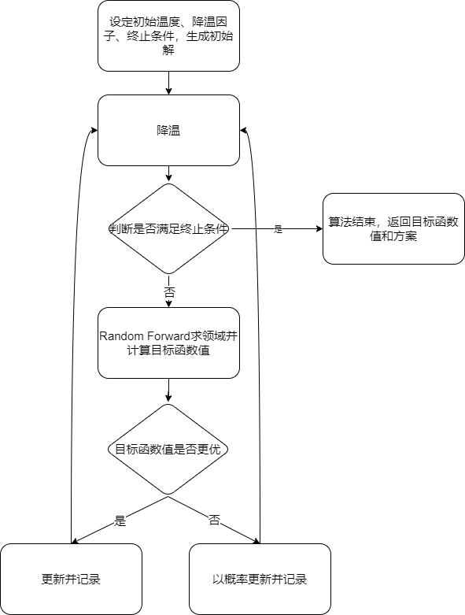


## 3.实验（Experiments）

### 3.1 实验设置

​		本算法运行环境：

- Ubuntu 18.04.5 LTS

- CPU：Intel(R) Core(TM) i9-10900K CPU @ 3.70GHz

- Graphics card：GeForce RTX 3090

- Python 3.8.5 64-bit

  算法超参数设计：

- $\alpha = 0.10$

- $k = 2000 $

- $T_\infty = 10^{-3}$

  随机种子：

- rand.seed(7)

### 3.2 实验结果

​		在11个给定的测试数据上运行算法，得到结果如下：

| 测试点 | 算法返回值 | 迭代轮次（大致） | 算法执行时间（秒） |
| :----: | :--------: | :--------------: | :----------------: |
|   0    |    7038    |     < 50000      |        5.44        |
|   1    |    8366    |      < 7000      |        1.39        |
|   2    |    7166    |     < 60000      |        7.43        |
|   3    |    7312    |     < 70000      |        2.08        |
|   4    |    8003    |     < 90000      |       14.35        |
|   5    |    7767    |     < 35000      |        5.86        |
|   6    |    1440    |     < 350000     |       446.55       |
|   7    |    1966    |     < 350000     |       895.57       |
|   8    |    1111    |     < 300000     |       86.12        |
|   9    |    1943    |     < 350000     |       907.27       |
|   10   |    3277    |     < 800000     |      5389.72       |

​		测试点0-10的目标函数值-迭代轮次图（current/neighbor time-iterate round figure）见附录1. 各个测试点的 $sol$ 矩阵（**加工方案**）见附录2. 

​		可以看出，本文算法对于小规模输入，算法迭代轮次较少，算法较快终止. 而对于大规模输入，算法迭代轮次明显增加. 对于任意的输入数据，算法都能保证在目标函数收敛至最优解或近似最优解时停止目标函数下降曲线平滑. 而一般的退火策略（固定 $\beta$ 和 $T_\infty$ ）在小规模输入上迭代轮次太多，徒增时间开销. 在大规模输入上迭代轮次又不足，目标函数值还没有收敛算法即停止. 目标函数下降曲线波动剧烈，对解的选择控制不足. 

## 4.总结（Conclusion and Discussion)

​		本文提出了一种自适应的模拟退火算法以解决Flow Shop调度问题. 设定 $T_0, \beta$ 与输入数据相关，实现算法对数据的适应，使得算法在不同规模的输入数据上的效率和性能都能有良好的表现. 同时，本文给出了一种解空间的设计，使得解的结构自然满足问题的约束条件，简化了目标函数和领域的设计. 

​		进一步地，本算法仍存在一些问题. 第一，$T_\infty$ 的设计不佳，未能考虑到算法后期 $T$ 与 $\Delta E$ 的数量级关系，对于 $p_{i,j}$ 过小或过大的输入数据的适应性较差，可以考虑在 $T_\infty$ 的表达式中引入有关 $p_{i,j}$ 的项. 第二，目标函数的计算效率仍有优化空间，`Random Forward`操作后无需重新计算整个$cost_{m\times n}$数组，只需在修改发生的地方之后重新计算即可. 第三，超参数的设计仍有调整空间. 


## 参考文献（Reference）

1. BUCKER P, KNUST S, CHENG T C E, et al. Complexity results for flow-shop and open-shop scheduling problems with transportation delays[J]. Annals of Operations Research, 2004, 129(1–4): 81–106.
2. DELL’AMICO M. Shop problems with two machines and time lags[J]. Operations Research, 1996, 44(5): 777–787.
3. Osman I H, Potts C N. Simulated annealing for permutation flow-shop scheduling[J]. Omega, 1989, 17(6): 551-557.
4. 帅天平, 余金果, 孙玲. 一种求解延迟工件数最小的混合流水车间调度问题的模拟退火算法[J]. 运筹学学报, 2013, 2.
5. Kirkpatrick S, Gelatt C D, Vecchi M P. Optimization by simulated annealing[J]. science, 1983, 220(4598): 671-680.


## 附录（Appendix）

### 1. 时间-迭代轮次图（current/neighbor time-iterate round figure）

测试点0：

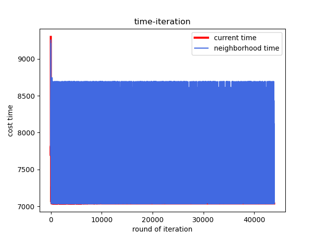

测试点1：

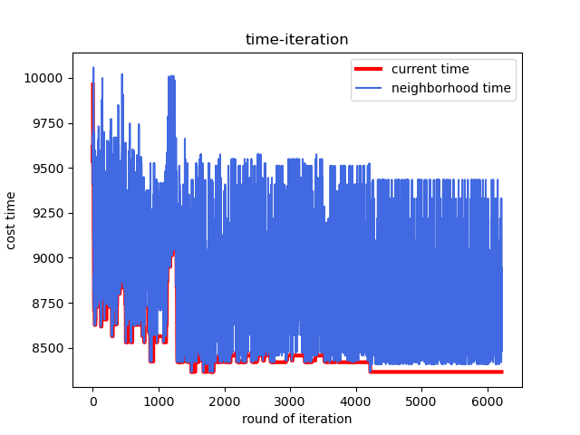

测试点2：

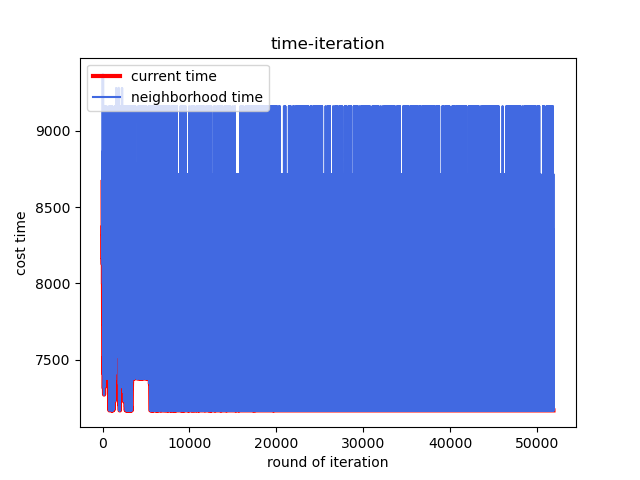

测试点3：

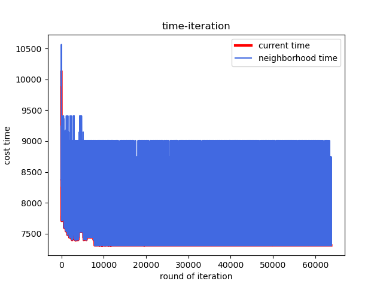

测试点4：

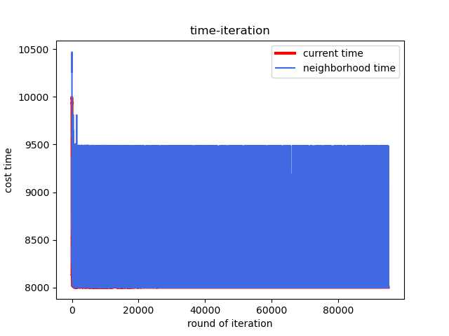

测试点5：

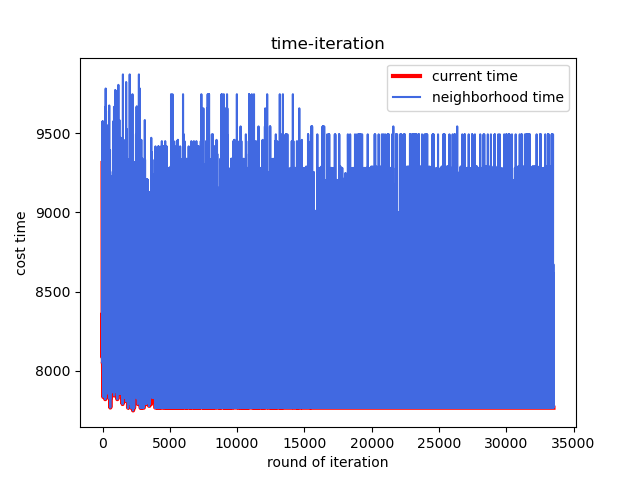

测试点6：

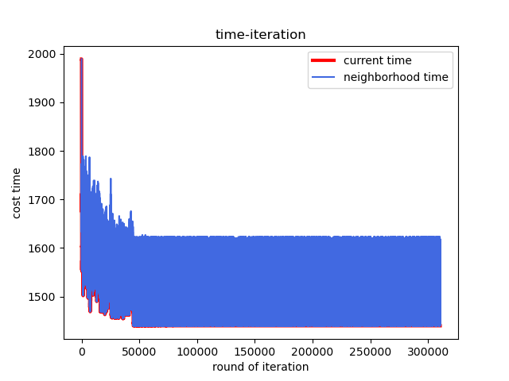

测试点7：

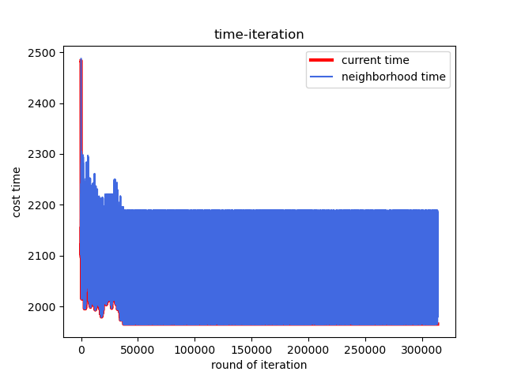

测试点8：

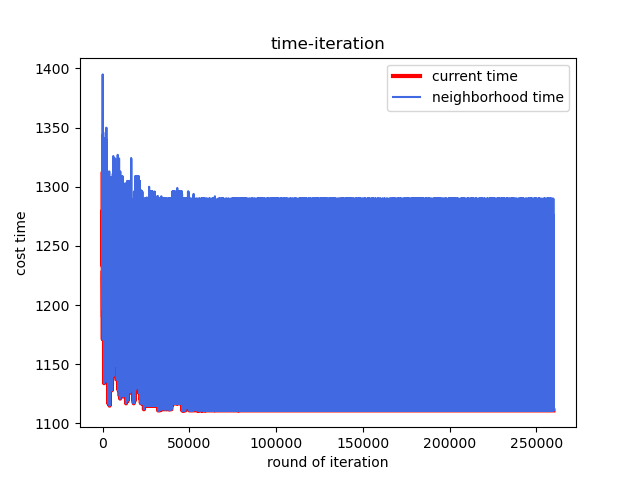

测试点9：

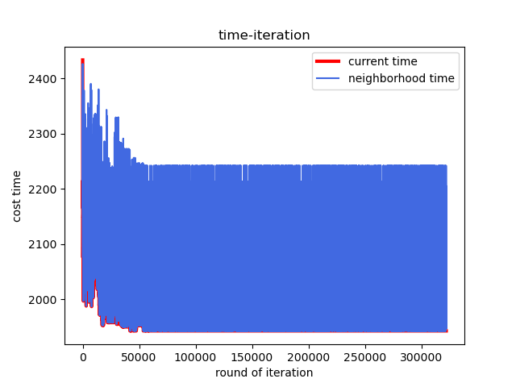

测试点10：

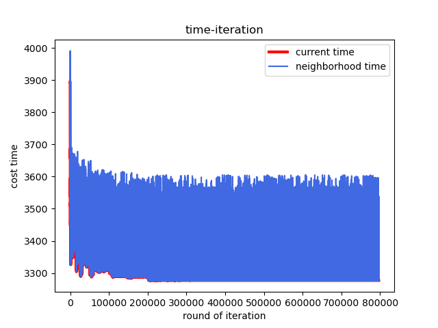

### 2. $sol$矩阵

$sol$矩阵给出了每个样例的加工方案，详细定义请查阅[2.1 解空间设计](#jump) 

测试点0：

```python
7038.0
[[ 7.  4.  8.  0.  3.  1.  2. 10.  6.  5.  9.]
 [ 7.  4.  8.  0.  3.  1.  2. 10.  6.  5.  9.]
 [ 7.  4.  8.  0.  3.  1.  2. 10.  6.  5.  9.]
 [ 7.  4.  8.  0.  3.  1.  2. 10.  6.  5.  9.]
 [ 7.  4.  8.  0.  3.  1.  2. 10.  6.  5.  9.]]
```

测试点1：

```python
8366.0
[[6. 2. 7. 4. 1. 0. 5. 3.]
 [6. 2. 7. 4. 1. 0. 5. 3.]
 [6. 2. 7. 4. 1. 0. 5. 3.]
 [6. 2. 7. 4. 1. 0. 5. 3.]
 [6. 2. 7. 4. 1. 0. 5. 3.]
 [6. 2. 7. 4. 1. 0. 5. 3.]
 [6. 2. 7. 4. 1. 0. 5. 3.]
 [6. 2. 7. 4. 1. 0. 5. 3.]]
```

测试点2：

```python
7166.0
[[ 6.  2.  3. 10.  8.  0. 12.  9.  7.  1. 11.  4.  5.]
 [ 6.  2.  3. 10.  8.  0. 12.  9.  7.  1. 11.  4.  5.]
 [ 6.  2.  3. 10.  8.  0. 12.  9.  7.  1. 11.  4.  5.]
 [ 6.  2.  3. 10.  8.  0. 12.  9.  7.  1. 11.  4.  5.]]
```

测试点3：

```python
7312.0
[[10. 11.  5.  4.  9.  8.  2.  1.  3.  6.  7.  0.]
 [10. 11.  5.  4.  9.  8.  2.  1.  3.  6.  7.  0.]
 [10. 11.  5.  4.  9.  8.  2.  1.  3.  6.  7.  0.]
 [10. 11.  5.  4.  9.  8.  2.  1.  3.  6.  7.  0.]
 [10. 11.  5.  4.  9.  8.  2.  1.  3.  6.  7.  0.]]
```

测试点4：

```python
8003.0
[[ 3. 13.  9. 11.  5.  8.  2.  6. 12.  0.  1. 10.  7.  4.]
 [ 3. 13.  9. 11.  5.  8.  2.  6. 12.  0.  1. 10.  7.  4.]
 [ 3. 13.  9. 11.  5.  8.  2.  6. 12.  0.  1. 10.  7.  4.]
 [ 3. 13.  9. 11.  5.  8.  2.  6. 12.  0.  1. 10.  7.  4.]]
```

测试点5：

```python
7767.0
[[3. 4. 2. 0. 9. 1. 7. 5. 8. 6.]
 [3. 4. 2. 0. 9. 1. 7. 5. 8. 6.]
 [3. 4. 2. 0. 9. 1. 7. 5. 8. 6.]
 [3. 4. 2. 0. 9. 1. 7. 5. 8. 6.]
 [3. 4. 2. 0. 9. 1. 7. 5. 8. 6.]
 [3. 4. 2. 0. 9. 1. 7. 5. 8. 6.]]
```

测试点6：

```python
1440.0
[[15. 13.  1.  3. 12.  9. 18.  7. 10. 19.  8.  0. 11. 14.  2.  6. 16.  4.
  17.  5.]
 [15. 13.  1.  3. 12.  9. 18.  7. 10. 19.  8.  0. 11. 14.  2.  6. 16.  4.
  17.  5.]
 [15. 13.  1.  3. 12.  9. 18.  7. 10. 19.  8.  0. 11. 14.  2.  6. 16.  4.
  17.  5.]
 [15. 13.  1.  3. 12.  9. 18.  7. 10. 19.  8.  0. 11. 14.  2.  6. 16.  4.
  17.  5.]
 [15. 13.  1.  3. 12.  9. 18.  7. 10. 19.  8.  0. 11. 14.  2.  6. 16.  4.
  17.  5.]
 [15. 13.  1.  3. 12.  9. 18.  7. 10. 19.  8.  0. 11. 14.  2.  6. 16.  4.
  17.  5.]
 [15. 13.  1.  3. 12.  9. 18.  7. 10. 19.  8.  0. 11. 14.  2.  6. 16.  4.
  17.  5.]
 [15. 13.  1.  3. 12.  9. 18.  7. 10. 19.  8.  0. 11. 14.  2.  6. 16.  4.
  17.  5.]
 [15. 13.  1.  3. 12.  9. 18.  7. 10. 19.  8.  0. 11. 14.  2.  6. 16.  4.
  17.  5.]
 [15. 13.  1.  3. 12.  9. 18.  7. 10. 19.  8.  0. 11. 14.  2.  6. 16.  4.
  17.  5.]]
```

测试点7：

```python
1966.0
[[11.  4. 14.  5. 18. 12.  8. 13. 17. 16. 19.  0. 10.  7.  2. 15.  1.  9.
   3.  6.]
 [11.  4. 14.  5. 18. 12.  8. 13. 17. 16. 19.  0. 10.  7.  2. 15.  1.  9.
   3.  6.]
 [11.  4. 14.  5. 18. 12.  8. 13. 17. 16. 19.  0. 10.  7.  2. 15.  1.  9.
   3.  6.]
 [11.  4. 14.  5. 18. 12.  8. 13. 17. 16. 19.  0. 10.  7.  2. 15.  1.  9.
   3.  6.]
 [11.  4. 14.  5. 18. 12.  8. 13. 17. 16. 19.  0. 10.  7.  2. 15.  1.  9.
   3.  6.]
 [11.  4. 14.  5. 18. 12.  8. 13. 17. 16. 19.  0. 10.  7.  2. 15.  1.  9.
   3.  6.]
 [11.  4. 14.  5. 18. 12.  8. 13. 17. 16. 19.  0. 10.  7.  2. 15.  1.  9.
   3.  6.]
 [11.  4. 14.  5. 18. 12.  8. 13. 17. 16. 19.  0. 10.  7.  2. 15.  1.  9.
   3.  6.]
 [11.  4. 14.  5. 18. 12.  8. 13. 17. 16. 19.  0. 10.  7.  2. 15.  1.  9.
   3.  6.]
 [11.  4. 14.  5. 18. 12.  8. 13. 17. 16. 19.  0. 10.  7.  2. 15.  1.  9.
   3.  6.]
 [11.  4. 14.  5. 18. 12.  8. 13. 17. 16. 19.  0. 10.  7.  2. 15.  1.  9.
   3.  6.]
 [11.  4. 14.  5. 18. 12.  8. 13. 17. 16. 19.  0. 10.  7.  2. 15.  1.  9.
   3.  6.]
 [11.  4. 14.  5. 18. 12.  8. 13. 17. 16. 19.  0. 10.  7.  2. 15.  1.  9.
   3.  6.]
 [11.  4. 14.  5. 18. 12.  8. 13. 17. 16. 19.  0. 10.  7.  2. 15.  1.  9.
   3.  6.]
 [11.  4. 14.  5. 18. 12.  8. 13. 17. 16. 19.  0. 10.  7.  2. 15.  1.  9.
   3.  6.]]
```

测试点8：

```python
1111.0
[[13.  5.  6.  7. 16.  3.  2. 12. 10. 15.  9.  4.  0.  1. 14. 18. 17. 11.
   8. 19.]
 [13.  5.  6.  7. 16.  3.  2. 12. 10. 15.  9.  4.  0.  1. 14. 18. 17. 11.
   8. 19.]
 [13.  5.  6.  7. 16.  3.  2. 12. 10. 15.  9.  4.  0.  1. 14. 18. 17. 11.
   8. 19.]
 [13.  5.  6.  7. 16.  3.  2. 12. 10. 15.  9.  4.  0.  1. 14. 18. 17. 11.
   8. 19.]
 [13.  5.  6.  7. 16.  3.  2. 12. 10. 15.  9.  4.  0.  1. 14. 18. 17. 11.
   8. 19.]]
```

测试点9：

```python
1943.0
[[ 4. 12. 19. 17. 16.  3. 11.  7.  6. 10.  2. 18.  1. 14.  8. 13. 15.  9.
   0.  5.]
 [ 4. 12. 19. 17. 16.  3. 11.  7.  6. 10.  2. 18.  1. 14.  8. 13. 15.  9.
   0.  5.]
 [ 4. 12. 19. 17. 16.  3. 11.  7.  6. 10.  2. 18.  1. 14.  8. 13. 15.  9.
   0.  5.]
 [ 4. 12. 19. 17. 16.  3. 11.  7.  6. 10.  2. 18.  1. 14.  8. 13. 15.  9.
   0.  5.]
 [ 4. 12. 19. 17. 16.  3. 11.  7.  6. 10.  2. 18.  1. 14.  8. 13. 15.  9.
   0.  5.]
 [ 4. 12. 19. 17. 16.  3. 11.  7.  6. 10.  2. 18.  1. 14.  8. 13. 15.  9.
   0.  5.]
 [ 4. 12. 19. 17. 16.  3. 11.  7.  6. 10.  2. 18.  1. 14.  8. 13. 15.  9.
   0.  5.]
 [ 4. 12. 19. 17. 16.  3. 11.  7.  6. 10.  2. 18.  1. 14.  8. 13. 15.  9.
   0.  5.]
 [ 4. 12. 19. 17. 16.  3. 11.  7.  6. 10.  2. 18.  1. 14.  8. 13. 15.  9.
   0.  5.]
 [ 4. 12. 19. 17. 16.  3. 11.  7.  6. 10.  2. 18.  1. 14.  8. 13. 15.  9.
   0.  5.]
 [ 4. 12. 19. 17. 16.  3. 11.  7.  6. 10.  2. 18.  1. 14.  8. 13. 15.  9.
   0.  5.]
 [ 4. 12. 19. 17. 16.  3. 11.  7.  6. 10.  2. 18.  1. 14.  8. 13. 15.  9.
   0.  5.]
 [ 4. 12. 19. 17. 16.  3. 11.  7.  6. 10.  2. 18.  1. 14.  8. 13. 15.  9.
   0.  5.]
 [ 4. 12. 19. 17. 16.  3. 11.  7.  6. 10.  2. 18.  1. 14.  8. 13. 15.  9.
   0.  5.]
 [ 4. 12. 19. 17. 16.  3. 11.  7.  6. 10.  2. 18.  1. 14.  8. 13. 15.  9.
   0.  5.]]
```

测试点10：

```python
3277.0
[[12. 24. 13.  4.  1. 37.  5. 39. 38. 19. 41. 32. 22.  8. 10. 49. 33. 26.
  43. 31.  2. 34. 47. 17. 40.  9. 46. 44.  7. 14.  6. 48. 21. 45. 16. 29.
  11. 35. 28. 36. 20. 18.  3. 42. 15. 25.  0. 27. 23. 30.]
 [12. 24. 13.  4.  1. 37.  5. 39. 38. 19. 41. 32. 22.  8. 10. 49. 33. 26.
  43. 31.  2. 34. 47. 17. 40.  9. 46. 44.  7. 14.  6. 48. 21. 45. 16. 29.
  11. 35. 28. 36. 20. 18.  3. 42. 15. 25.  0. 27. 23. 30.]
 [12. 24. 13.  4.  1. 37.  5. 39. 38. 19. 41. 32. 22.  8. 10. 49. 33. 26.
  43. 31.  2. 34. 47. 17. 40.  9. 46. 44.  7. 14.  6. 48. 21. 45. 16. 29.
  11. 35. 28. 36. 20. 18.  3. 42. 15. 25.  0. 27. 23. 30.]
 [12. 24. 13.  4.  1. 37.  5. 39. 38. 19. 41. 32. 22.  8. 10. 49. 33. 26.
  43. 31.  2. 34. 47. 17. 40.  9. 46. 44.  7. 14.  6. 48. 21. 45. 16. 29.
  11. 35. 28. 36. 20. 18.  3. 42. 15. 25.  0. 27. 23. 30.]
 [12. 24. 13.  4.  1. 37.  5. 39. 38. 19. 41. 32. 22.  8. 10. 49. 33. 26.
  43. 31.  2. 34. 47. 17. 40.  9. 46. 44.  7. 14.  6. 48. 21. 45. 16. 29.
  11. 35. 28. 36. 20. 18.  3. 42. 15. 25.  0. 27. 23. 30.]
 [12. 24. 13.  4.  1. 37.  5. 39. 38. 19. 41. 32. 22.  8. 10. 49. 33. 26.
  43. 31.  2. 34. 47. 17. 40.  9. 46. 44.  7. 14.  6. 48. 21. 45. 16. 29.
  11. 35. 28. 36. 20. 18.  3. 42. 15. 25.  0. 27. 23. 30.]
 [12. 24. 13.  4.  1. 37.  5. 39. 38. 19. 41. 32. 22.  8. 10. 49. 33. 26.
  43. 31.  2. 34. 47. 17. 40.  9. 46. 44.  7. 14.  6. 48. 21. 45. 16. 29.
  11. 35. 28. 36. 20. 18.  3. 42. 15. 25.  0. 27. 23. 30.]
 [12. 24. 13.  4.  1. 37.  5. 39. 38. 19. 41. 32. 22.  8. 10. 49. 33. 26.
  43. 31.  2. 34. 47. 17. 40.  9. 46. 44.  7. 14.  6. 48. 21. 45. 16. 29.
  11. 35. 28. 36. 20. 18.  3. 42. 15. 25.  0. 27. 23. 30.]
 [12. 24. 13.  4.  1. 37.  5. 39. 38. 19. 41. 32. 22.  8. 10. 49. 33. 26.
  43. 31.  2. 34. 47. 17. 40.  9. 46. 44.  7. 14.  6. 48. 21. 45. 16. 29.
  11. 35. 28. 36. 20. 18.  3. 42. 15. 25.  0. 27. 23. 30.]
 [12. 24. 13.  4.  1. 37.  5. 39. 38. 19. 41. 32. 22.  8. 10. 49. 33. 26.
  43. 31.  2. 34. 47. 17. 40.  9. 46. 44.  7. 14.  6. 48. 21. 45. 16. 29.
  11. 35. 28. 36. 20. 18.  3. 42. 15. 25.  0. 27. 23. 30.]]
```

